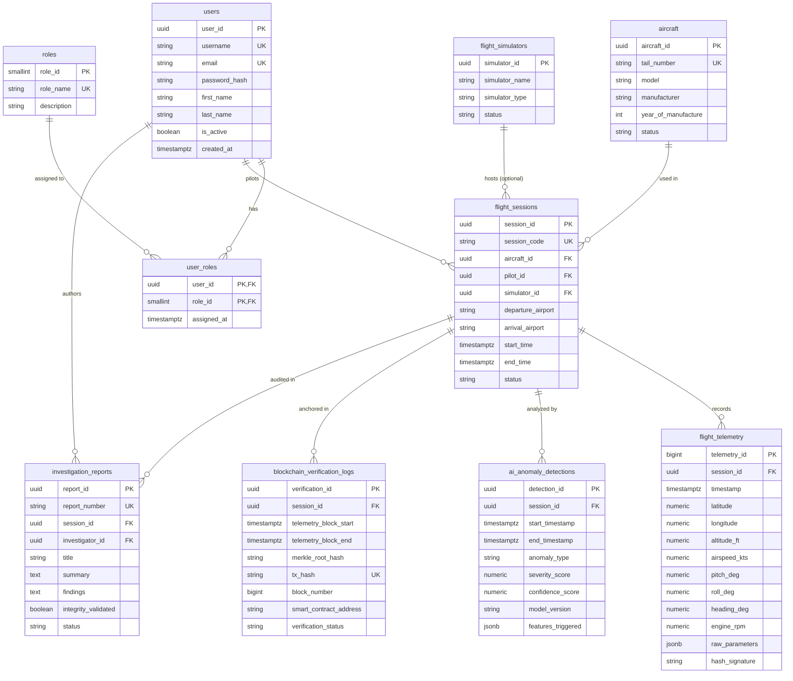

# SkyVault - Database Architecture & Entity-Relationship Design

> **System**: SkyVault – AI-Based Intelligent Cloud Flight Recorder with Blockchain Data Integrity Verification  
> **Database Engine**: PostgreSQL 15+ (Time-Series & JSONB Optimized)  
> **Normalization Standard**: Third Normal Form (3NF)

---

## 1. Executive Summary & System Domain

The **SkyVault** database is architected to handle three distinct operational workloads:
1. **Relational Core**: High-reliability transactional management of Users, Roles, Aircraft, Simulators, and Flight Sessions.
2. **High-Frequency Telemetry Ingestion**: Scalable time-series recording of flight data parameters (altitude, speed, pitch, roll, engine RPM, GPS coordinates).
3. **Audit & Integrity Verification**: Storage of AI/ML anomaly detection scores, Merkle tree cryptographic hashes, Ethereum smart contract transaction anchors, and formal incident investigation reports.

---

## 2. Identified System Entities

| Entity Name | Database Table Name | Operational Domain |
| :--- | :--- | :--- |
| **User Authentication** | `users` | Account identity, credentials hash, and account status |
| **User Role** | `roles` | Access control definitions (RBAC) |
| **User Role Mapping** | `user_roles` | Many-to-Many junction between Users and Roles |
| **Aircraft** | `aircraft` | Physical or virtual aircraft fleet inventory |
| **Flight Simulator** | `flight_simulators` | Telemetry stream source or hardware simulator profile |
| **Flight Session** | `flight_sessions` | Metadata for a specific flight recording session |
| **Flight Telemetry** | `flight_telemetry` | High-frequency time-series flight parameters (Black Box) |
| **AI Anomaly Detection** | `ai_anomaly_detections` | Machine learning detection results & severity metrics |
| **Blockchain Integrity Log**| `blockchain_verification_logs` | On-chain Merkle root anchors & cryptographic proofs |
| **Investigation Report** | `investigation_reports` | Post-flight analysis and safety audit reports |

---

## 3. Comprehensive Entity & Table Specification

### 3.1 `users`
- **Purpose**: Stores authenticated system entities (Pilots, Safety Investigators, System Administrators, Auditors).

| Attribute Name | PostgreSQL Data Type | Constraints | Description |
| :--- | :--- | :--- | :--- |
| `user_id` | `UUID` | `PRIMARY KEY`, `DEFAULT gen_random_uuid()` | Unique user identifier |
| `username` | `VARCHAR(50)` | `NOT NULL`, `UNIQUE` | Unique login username |
| `email` | `VARCHAR(255)` | `NOT NULL`, `UNIQUE` | Validated user email address |
| `password_hash` | `VARCHAR(255)` | `NOT NULL` | Argon2id / BCrypt password hash |
| `first_name` | `VARCHAR(100)` | `NOT NULL` | User's first name |
| `last_name` | `VARCHAR(100)` | `NOT NULL` | User's last name |
| `is_active` | `BOOLEAN` | `NOT NULL`, `DEFAULT true` | Account active flag |
| `created_at` | `TIMESTAMPTZ` | `NOT NULL`, `DEFAULT CURRENT_TIMESTAMP` | Account creation timestamp |
| `updated_at` | `TIMESTAMPTZ` | `NOT NULL`, `DEFAULT CURRENT_TIMESTAMP` | Last profile update timestamp |

---

### 3.2 `roles`
- **Purpose**: Defines system privileges (`ROLE_ADMIN`, `ROLE_PILOT`, `ROLE_INVESTIGATOR`, `ROLE_AUDITOR`).

| Attribute Name | PostgreSQL Data Type | Constraints | Description |
| :--- | :--- | :--- | :--- |
| `role_id` | `SMALLINT` | `PRIMARY KEY`, `GENERATED ALWAYS AS IDENTITY` | Role identifier |
| `role_name` | `VARCHAR(50)` | `NOT NULL`, `UNIQUE` | Standardized role string |
| `description` | `VARCHAR(255)` | `NULL` | Human-readable role description |

---

### 3.3 `user_roles`
- **Purpose**: Implements 3NF Many-to-Many relationship between Users and Roles.

| Attribute Name | PostgreSQL Data Type | Constraints | Description |
| :--- | :--- | :--- | :--- |
| `user_id` | `UUID` | `FK -> users(user_id) ON DELETE CASCADE` | Associated user ID |
| `role_id` | `SMALLINT` | `FK -> roles(role_id) ON DELETE CASCADE` | Associated role ID |
| `assigned_at` | `TIMESTAMPTZ` | `NOT NULL`, `DEFAULT CURRENT_TIMESTAMP` | Timestamp of role grant |

- **Primary Key**: Composite (`user_id`, `role_id`)

---

### 3.4 `aircraft`
- **Purpose**: Stores metadata about registered aircraft.

| Attribute Name | PostgreSQL Data Type | Constraints | Description |
| :--- | :--- | :--- | :--- |
| `aircraft_id` | `UUID` | `PRIMARY KEY`, `DEFAULT gen_random_uuid()` | Unique aircraft ID |
| `tail_number` | `VARCHAR(20)` | `NOT NULL`, `UNIQUE` | International registration tail number |
| `model` | `VARCHAR(100)` | `NOT NULL` | Aircraft model (e.g. Boeing 737-800, Cessna 172) |
| `manufacturer` | `VARCHAR(100)` | `NOT NULL` | Aircraft manufacturer |
| `year_of_manufacture`| `INT` | `CHECK (year_of_manufacture >= 1900)` | Production year |
| `status` | `VARCHAR(30)` | `NOT NULL`, `DEFAULT 'ACTIVE'` | Operational status (`ACTIVE`, `MAINTENANCE`) |
| `created_at` | `TIMESTAMPTZ` | `NOT NULL`, `DEFAULT CURRENT_TIMESTAMP` | Registration timestamp |

---

### 3.5 `flight_simulators`
- **Purpose**: Configures simulator environments streaming simulated telemetry (X-Plane, MSFS, Hardware HIL).

| Attribute Name | PostgreSQL Data Type | Constraints | Description |
| :--- | :--- | :--- | :--- |
| `simulator_id` | `UUID` | `PRIMARY KEY`, `DEFAULT gen_random_uuid()` | Unique simulator ID |
| `simulator_name` | `VARCHAR(100)` | `NOT NULL` | Simulator instance name |
| `simulator_type` | `VARCHAR(50)` | `NOT NULL` | Software/Hardware engine type |
| `location` | `VARCHAR(100)` | `NULL` | Facility location |
| `status` | `VARCHAR(30)` | `NOT NULL`, `DEFAULT 'ONLINE'` | Status (`ONLINE`, `OFFLINE`) |
| `created_at` | `TIMESTAMPTZ` | `NOT NULL`, `DEFAULT CURRENT_TIMESTAMP` | Config creation timestamp |

---

### 3.6 `flight_sessions`
- **Purpose**: Central ledger entity recording a single flight session (live or simulated).

| Attribute Name | PostgreSQL Data Type | Constraints | Description |
| :--- | :--- | :--- | :--- |
| `session_id` | `UUID` | `PRIMARY KEY`, `DEFAULT gen_random_uuid()` | Unique session identifier |
| `session_code` | `VARCHAR(50)` | `NOT NULL`, `UNIQUE` | Human-readable session code (e.g. `FL-2026-0089`) |
| `aircraft_id` | `UUID` | `NOT NULL`, `FK -> aircraft(aircraft_id)` | Assigned aircraft |
| `pilot_id` | `UUID` | `NOT NULL`, `FK -> users(user_id)` | Operating pilot |
| `simulator_id` | `UUID` | `NULL`, `FK -> flight_simulators(simulator_id)` | Simulator ID (NULL if real flight) |
| `departure_airport`| `VARCHAR(10)` | `NOT NULL` | ICAO/IATA code (e.g. `KJFK`, `EGLL`) |
| `arrival_airport` | `VARCHAR(10)` | `NOT NULL` | Destination airport code |
| `start_time` | `TIMESTAMPTZ` | `NOT NULL` | Session initialization timestamp |
| `end_time` | `TIMESTAMPTZ` | `NULL` | Session completion timestamp |
| `status` | `VARCHAR(30)` | `NOT NULL`, `DEFAULT 'IN_FLIGHT'` | Status (`IN_FLIGHT`, `COMPLETED`, `ABORTED`) |
| `created_at` | `TIMESTAMPTZ` | `NOT NULL`, `DEFAULT CURRENT_TIMESTAMP` | Record creation timestamp |

---

### 3.7 `flight_telemetry`
- **Purpose**: High-rate flight data recorder stream (Black Box telemetry).

| Attribute Name | PostgreSQL Data Type | Constraints | Description |
| :--- | :--- | :--- | :--- |
| `telemetry_id` | `BIGINT` | `PRIMARY KEY`, `GENERATED ALWAYS AS IDENTITY` | Sequential time-series ID |
| `session_id` | `UUID` | `NOT NULL`, `FK -> flight_sessions(session_id)` | Associated session ID |
| `timestamp` | `TIMESTAMPTZ` | `NOT NULL` | Exact telemetry sample timestamp |
| `latitude` | `NUMERIC(9,6)` | `NOT NULL` | GPS Latitude (-90.0 to +90.0) |
| `longitude` | `NUMERIC(10,6)`| `NOT NULL` | GPS Longitude (-180.0 to +180.0) |
| `altitude_ft` | `NUMERIC(8,2)` | `NOT NULL` | Altitude in feet |
| `airspeed_kts` | `NUMERIC(6,2)` | `NOT NULL` | Indicated airspeed in knots |
| `pitch_deg` | `NUMERIC(5,2)` | `NOT NULL` | Pitch angle (-90.0° to +90.0°) |
| `roll_deg` | `NUMERIC(5,2)` | `NOT NULL` | Roll angle (-180.0° to +180.0°) |
| `heading_deg` | `NUMERIC(5,2)` | `NOT NULL` | Heading angle (0.0° to 360.0°) |
| `engine_rpm` | `NUMERIC(7,2)` | `NOT NULL` | Primary engine RPM |
| `raw_parameters` | `JSONB` | `NULL` | Flexible JSON storage for extra sensor data |
| `hash_signature` | `VARCHAR(64)` | `NOT NULL` | SHA-256 hash of this frame for local integrity |

---

### 3.8 `ai_anomaly_detections`
- **Purpose**: Records machine learning engine anomaly detections.

| Attribute Name | PostgreSQL Data Type | Constraints | Description |
| :--- | :--- | :--- | :--- |
| `detection_id` | `UUID` | `PRIMARY KEY`, `DEFAULT gen_random_uuid()` | Unique detection ID |
| `session_id` | `UUID` | `NOT NULL`, `FK -> flight_sessions(session_id)` | Associated session ID |
| `start_timestamp` | `TIMESTAMPTZ` | `NOT NULL` | Anomaly timeframe start |
| `end_timestamp` | `TIMESTAMPTZ` | `NOT NULL` | Anomaly timeframe end |
| `anomaly_type` | `VARCHAR(50)` | `NOT NULL` | Category (`STALL_RISK`, `RAPID_DESCENT`, etc.) |
| `severity_score` | `NUMERIC(4,3)` | `NOT NULL`, `CHECK (severity_score BETWEEN 0 AND 1)`| AI anomaly severity rating (0.000 - 1.000) |
| `confidence_score`| `NUMERIC(4,3)` | `NOT NULL` | Model confidence probability |
| `model_version` | `VARCHAR(30)` | `NOT NULL` | Version of PyTorch/Scikit-learn model |
| `features_triggered`|`JSONB` | `NULL` | Explanation of features causing trigger |
| `detected_at` | `TIMESTAMPTZ` | `NOT NULL`, `DEFAULT CURRENT_TIMESTAMP` | Analysis creation timestamp |

---

### 3.9 `blockchain_verification_logs`
- **Purpose**: Cryptographic proof records tying flight sessions & Merkle roots to smart contract state on Ethereum / EVM layer.

| Attribute Name | PostgreSQL Data Type | Constraints | Description |
| :--- | :--- | :--- | :--- |
| `verification_id` | `UUID` | `PRIMARY KEY`, `DEFAULT gen_random_uuid()` | Verification record ID |
| `session_id` | `UUID` | `NOT NULL`, `FK -> flight_sessions(session_id)` | Target flight session |
| `telemetry_block_start`| `TIMESTAMPTZ`| `NOT NULL` | Start timestamp of telemetry block |
| `telemetry_block_end` | `TIMESTAMPTZ`| `NOT NULL` | End timestamp of telemetry block |
| `merkle_root_hash`| `VARCHAR(66)` | `NOT NULL` | 256-bit Merkle tree root (0x + 64 hex chars) |
| `tx_hash` | `VARCHAR(66)` | `NOT NULL`, `UNIQUE` | EVM Transaction Hash |
| `block_number` | `BIGINT` | `NOT NULL` | Blockchain block number |
| `smart_contract_address`| `VARCHAR(42)`| `NOT NULL` | Ethereum Smart Contract address |
| `verification_status`| `VARCHAR(30)` | `NOT NULL`, `DEFAULT 'VERIFIED_ON_CHAIN'` | Status (`VERIFIED`, `TAMPER_DETECTED`) |
| `anchored_at` | `TIMESTAMPTZ` | `NOT NULL`, `DEFAULT CURRENT_TIMESTAMP` | On-chain mining timestamp |

---

### 3.10 `investigation_reports`
- **Purpose**: Official audit and investigation reports produced by aviation safety officers.

| Attribute Name | PostgreSQL Data Type | Constraints | Description |
| :--- | :--- | :--- | :--- |
| `report_id` | `UUID` | `PRIMARY KEY`, `DEFAULT gen_random_uuid()` | Unique report identifier |
| `report_number` | `VARCHAR(50)` | `NOT NULL`, `UNIQUE` | Reference identifier (e.g. `INV-2026-004`) |
| `session_id` | `UUID` | `NOT NULL`, `FK -> flight_sessions(session_id)` | Flight session under investigation |
| `investigator_id` | `UUID` | `NOT NULL`, `FK -> users(user_id)` | User generating report |
| `title` | `VARCHAR(255)` | `NOT NULL` | Investigation report title |
| `summary` | `TEXT` | `NOT NULL` | Executive summary of incident/flight |
| `findings` | `TEXT` | `NOT NULL` | Detailed safety analysis findings |
| `recommendations` | `TEXT` | `NULL` | Corrective safety recommendations |
| `integrity_validated`| `BOOLEAN` | `NOT NULL`, `DEFAULT true` | Result of blockchain integrity check |
| `status` | `VARCHAR(30)` | `NOT NULL`, `DEFAULT 'DRAFT'` | Report lifecycle (`DRAFT`, `FINALIZED`) |
| `created_at` | `TIMESTAMPTZ` | `NOT NULL`, `DEFAULT CURRENT_TIMESTAMP` | Creation timestamp |
| `updated_at` | `TIMESTAMPTZ` | `NOT NULL`, `DEFAULT CURRENT_TIMESTAMP` | Last modification timestamp |

---

## 4. Entity Relationships Explanation

1. **`users` ↔ `roles` (Many-to-Many via `user_roles`)**:
   - A single user can have multiple security roles (e.g., both Pilot and Investigator).
   - A single role can belong to many users.

2. **`aircraft` ↔ `flight_sessions` (One-to-Many)**:
   - An aircraft can record zero, one, or many flight sessions over time.
   - Each flight session MUST belong to exactly one registered aircraft.

3. **`users` (Pilot) ↔ `flight_sessions` (One-to-Many)**:
   - A user with the Pilot role can command multiple flight sessions.
   - Each flight session is assigned to exactly one lead pilot.

4. **`flight_simulators` ↔ `flight_sessions` (One-to-Many, Optional)**:
   - A flight simulator hardware/software instance can host multiple flight sessions.
   - A flight session may optionally reference a simulator (NULL for physical live aircraft).

5. **`flight_sessions` ↔ `flight_telemetry` (One-to-Many)**:
   - A single flight session consists of thousands of time-stamped telemetry data frames.
   - Each telemetry frame belongs to exactly one flight session.

6. **`flight_sessions` ↔ `ai_anomaly_detections` (One-to-Many)**:
   - An AI model scan on a flight session can flag zero, one, or multiple anomaly intervals.
   - Each anomaly detection record is linked directly to the parent flight session.

7. **`flight_sessions` ↔ `blockchain_verification_logs` (One-to-Many)**:
   - Telemetry frames within a flight session are grouped into temporal batches and anchored to the blockchain, creating multiple verification block logs per session.
   - Each verification log references its parent flight session and Merkle root.

8. **`flight_sessions` ↔ `investigation_reports` (One-to-Many)**:
   - A flight session (especially one with anomalies) can be audited in zero, one, or multiple safety investigation reports.

9. **`users` (Investigator) ↔ `investigation_reports` (One-to-Many)**:
   - A safety investigator can author multiple investigation reports.
   - Each investigation report is authored by exactly one investigator.

---

## 5. Normalized Entity-Relationship Diagram (3NF)



---

## 6. Indexing & Query Optimization Recommendations

High-performance databases require tailored indexing strategies to handle time-series scans, fast REST API lookups, and security audits.

### 6.1 B-Tree Primary & Unique Key Indexes (Automatic)
- `users(username)`, `users(email)`
- `aircraft(tail_number)`
- `flight_sessions(session_code)`
- `blockchain_verification_logs(tx_hash)`
- `investigation_reports(report_number)`

### 6.2 Foreign Key Indexing (Eliminates Sequential Scans on Joins)
```sql
-- Fast lookup of all flights for a given aircraft or pilot
idx_flight_sessions_aircraft_id  -> flight_sessions(aircraft_id)
idx_flight_sessions_pilot_id     -> flight_sessions(pilot_id)

-- Fast lookup of telemetry, anomalies, blockchain logs, and reports by session
idx_flight_telemetry_session_id  -> flight_telemetry(session_id)
idx_ai_anomaly_session_id        -> ai_anomaly_detections(session_id)
idx_blockchain_logs_session_id   -> blockchain_verification_logs(session_id)
idx_investigation_rep_session_id -> investigation_reports(session_id)
```

### 6.3 Composite Time-Series & Filtering Indexes
```sql
-- Telemetry Time-Series Range Query Indexing (Flight playback graphs)
idx_telemetry_session_time       -> flight_telemetry(session_id, timestamp DESC)

-- Anomaly Filter Indexing (Fetch high severity anomalies quickly)
idx_anomaly_severity_type        -> ai_anomaly_detections(session_id, severity_score DESC)
```

### 6.4 Specialized PostgreSQL Indexing Strategy

1. **BRIN (Block Range Index) for Telemetry Timestamps**:
   - `flight_telemetry(timestamp)` using `BRIN`.
   - **Justification**: Telemetry is strictly appended in temporal order. BRIN indexes require less than 1% of the disk space of a B-Tree index, ensuring extreme scalability for millions of rows.

2. **Partial Index for Severe AI Anomalies**:
   - `ai_anomaly_detections(session_id, severity_score)` WHERE `severity_score >= 0.70`.
   - **Justification**: Speeds up emergency alert dashboards by indexing only high-severity flight risks.

3. **GIN (Generalized Inverted Index) for Dynamic Sensor JSONB**:
   - `flight_telemetry using GIN (raw_parameters)`.
   - **Justification**: Enables fast querying of unstructured or experimental flight parameters stored in `JSONB`.
