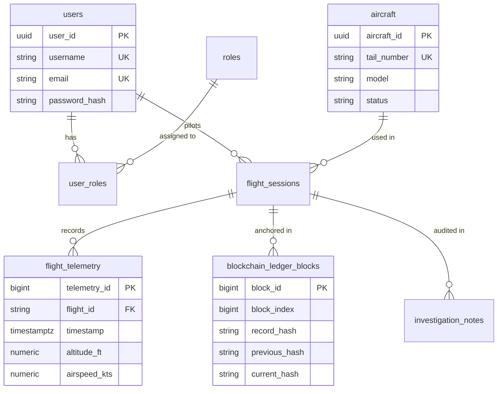

# Software Design Document (SDD): SkyVault

**Project Title:** SkyVault – AI-Based Intelligent Cloud Flight Recorder with Blockchain-Based Data Integrity Verification  
**Document Version:** 1.0.0  
**Status:** Approved & Finalized

---

## 1. High-Level Architecture Overview

SkyVault uses a decoupled microservices architecture comprising four primary services:

1. **React 18 Single-Page Application (SPA)**: Frontend dashboard.
2. **Spring Boot Core Backend**: Handles authentication, fleet management, telemetry persistence, and blockchain hash-chaining.
3. **Python FastAPI AI Engine**: Evaluates flight telemetry against 8 real-time hazard detection rules.
4. **Spring Boot Flight Simulator**: Generates synthetic flight dynamics.

---

## 2. Component Design & Subsystems

```
┌─────────────────────────────────────────────────────────────────────────────┐
│                           React 18 Frontend SPA                             │
│       [Dashboard] [Fleet] [Telemetry] [AI Alerts] [Chain] [Investigation]    │
└──────────────────────────────────────┬──────────────────────────────────────┘
                                       │ REST / JWT (Port 80/3000)
                                       ▼
┌─────────────────────────────────────────────────────────────────────────────┐
│                         Spring Boot Backend API                             │
│    [Security / JWT]   [Aircraft API]   [Telemetry API]   [Blockchain API]   │
└──────────────┬───────────────────────┬────────────────────────┬─────────────┘
               │ JDBC                  │ REST (Internal)        │ Hash Chain
               ▼                       ▼                        ▼
┌─────────────────────────────┐ ┌──────────────────────┐ ┌───────────────────┐
│     PostgreSQL Database     │ │ Python AI Service    │ │ Blockchain Ledger │
│ (`users`, `aircraft`, etc.) │ │ (FastAPI - Port 8082)│ │ (`ledger_blocks`) │
└─────────────────────────────┘ └──────────────────────┘ └───────────────────┘
```

---

## 3. Database Design & 3NF ER Diagram

The PostgreSQL database is normalized to Third Normal Form (3NF).



---

## 4. AI Anomaly Engine Design

The Python AI Service implements the **Strategy & Registry Pattern**. All anomaly detection rules inherit from `BaseAnomalyRule` and auto-register with `RuleEngineRegistry`.

```
                  ┌───────────────────────┐
                  │   BaseAnomalyRule     │ (Abstract Contract)
                  └───────────▲───────────┘
                              │
     ┌────────────────────────┼────────────────────────┐
     │                        │                        │
┌────┴──────────────┐   ┌─────┴─────────────┐    ┌─────┴──────────────┐
│RapidAltitudeDrop  │   │EngineOverheating  │    │  LowFuelRule       │ ... (8 Rules Total)
└───────────────────┘   └───────────────────┘    └────────────────────┘
```

---

## 5. Blockchain Cryptographic Hash-Chain Design

Every block $N$ stores:
1. `recordHash` = $\text{SHA-256}(\text{telemetry fields})$
2. `previousHash` = `currentHash` of Block $N-1$ (or 64 zeros for Genesis Block)
3. `currentHash` = $\text{SHA-256}(\text{blockIndex} \parallel \text{flightId} \parallel \text{telemetryId} \parallel \text{recordHash} \parallel \text{previousHash} \parallel \text{timestamp})$

Any tampering in PostgreSQL telemetry rows immediately breaks both the local `recordHash` check and the cascading `previousHash` pointer chain.
